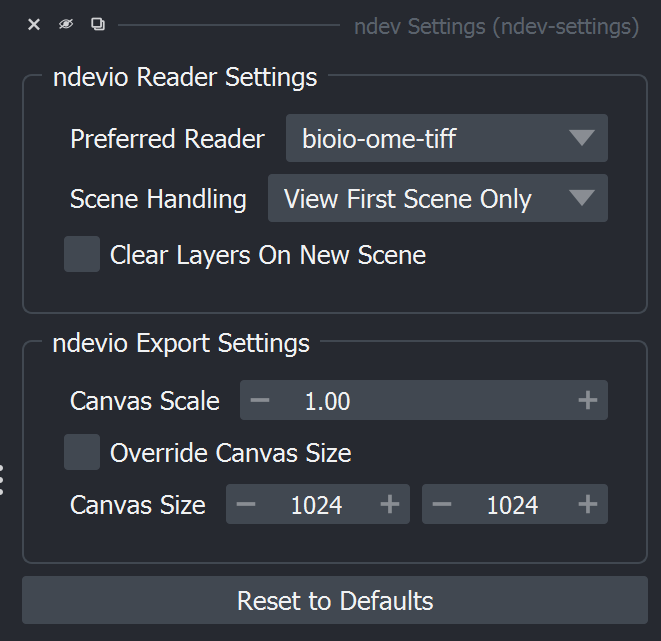

# ndev-settings

[](https://github.com/ndev-kit/ndev-settings/raw/main/LICENSE)
[](https://pypi.org/project/ndev-settings)
[](https://python.org)
[](https://github.com/ndev-kit/ndev-settings/actions)
[](https://codecov.io/gh/ndev-kit/ndev-settings)
[](https://napari-hub.org/plugins/ndev-settings)
[](https://napari.org/stable/plugins/index.html)
[](https://github.com/copier-org/copier)

Reusable settings and customization widget for the ndev-kit

----------------------------------

This [napari] plugin was generated with [copier] using the [napari-plugin-template] v1.1.0.

<!--
Don't miss the full getting started guide to set up your new package:
https://github.com/napari/napari-plugin-template#getting-started

and review the napari docs for plugin developers:
https://napari.org/stable/plugins/index.html
-->

## Installation

You can install `ndev-settings` via [pip]:

```
pip install ndev-settings
```

If napari is not already installed, you can install `ndev-settings` with napari and Qt via:

```
pip install "ndev-settings[all]"
```


To install latest development version :

```
pip install git+https://github.com/ndev-kit/ndev-settings.git
```

## Use with external libraries

External libraries can provide their settings in YAML format with the same structure as your main `ndev_settings.yaml`.

**Step 1**: Create a YAML file in the external library (e.g., `ndev_settings.yaml`):

```yaml
ndevio_Reader:
  preferred_reader:
    default: bioio-ome-tiff
    dynamic_choices:
      fallback_message: No readers found
      provider: bioio.readers
    tooltip: Preferred reader to use when opening images
    value: bioio-ome-tiff
  scene_handling:
    choices:
    - Open Scene Widget
    - View All Scenes
    - View First Scene Only
    default: Open Scene Widget
    tooltip: How to handle files with multiple scenes
    value: View First Scene Only
  clear_layers_on_new_scene:
    default: false
    tooltip: Whether to clear the viewer when selecting a new scene
    value: false

ndevio_Export:
  canvas_scale:
    default: 1.0
    max: 100.0
    min: 0.1
    tooltip: Scales exported figures and screenshots by this value
    value: 1.0
  override_canvas_size:
    default: false
    tooltip: Whether to override the canvas size when exporting canvas screenshot
    value: false
  canvas_size:
    default: !!python/tuple
    - 1024
    - 1024
    tooltip: Height x width of the canvas when exporting a screenshot
    value: !!python/tuple
    - 1024
    - 1024
```

**Step 2**: Register the entry point in `pyproject.toml`:

```toml
[project.entry-points."ndev_settings.manifest"]
ndevio = "ndevio:ndev_settings.yaml"
```

**Step 3**: Use the autogenerated widget in napari!



## Usage Example

```python
from ndev_settings import get_settings

settings = get_settings()

# Access settings from main file
print(settings.Canvas.canvas_scale)

# Access settings from external libraries (if installed)
print(settings.Reader.preferred_reader)  # From ndevio
print(settings.Export.compression_level)  # From ndevio

# Modify and save settings
settings.Canvas.canvas_scale = 2.0
settings.save()  # Persists across sessions

# Reset to defaults
settings.reset_to_default("canvas_scale")  # Reset single setting
settings.reset_to_default(group="Canvas")  # Reset entire group
settings.reset_to_default()  # Reset all settings
```

## Performance Note: npe1 Plugin Compatibility

If you have many legacy npe1 plugins installed (e.g., `napari-assistant`, `napari-segment-blobs-and-things-with-membranes`, `napari-simpleitk-image-processing`), you may experience slow widget loading times (10+ seconds) the first time you open the settings plugin widget in a napari session. This is a known issue in napari's npe1 compatibility layer, not specific to ndev-settings. The npe1 adapter iterates through all plugin widgets and performs expensive metadata lookups for each legacy plugin.

**Workaround**: If you don't need npe1 runtime behavior plugins, you can disable the adapter in napari:

1. Go to `File` -> `Preferences` -> `Plugins`
2. Uncheck "Use npe2 adaptor"
3. Restart napari

This dramatically improves widget loading times since only pure npe2 plugins are discovered.

## How Settings Persistence Works

Settings are automatically cached to improve startup performance:

1. **First load**: Settings are discovered from all installed packages via entry points, merged together, and saved to a user config file
2. **Subsequent loads**: Settings are loaded directly from the cached file (much faster)
3. **Package changes**: When packages are installed/removed, settings are re-discovered and merged while preserving your customizations

**Storage location**: Settings are stored in a platform-appropriate config directory:

- **Windows**: `%LOCALAPPDATA%\ndev-settings\settings.yaml`
- **macOS**: `~/Library/Application Support/ndev-settings/settings.yaml`
- **Linux**: `~/.config/ndev-settings/settings.yaml`

**Clearing the cache**: To force re-discovery of settings (e.g., after manual edits to package YAML files):

```python
from ndev_settings import clear_settings
clear_settings()  # Deletes cached settings, next load will re-discover
```

## Pre-commit hook

You can use the `reset-settings-values` pre-commit hook to reset all settings values
to their defaults before committing. To do so, add the following to your
`.pre-commit-config.yaml`:

```yaml
-   repo: https://github.com/ndev-kit/ndev-settings
    rev: v0.3.0
    hooks:
      - id: reset-settings-values
```

## Contributing

Contributions are very welcome. Tests can be run with [tox], please ensure
the coverage at least stays the same before you submit a pull request.

## License

Distributed under the terms of the [BSD-3] license,
"ndev-settings" is free and open source software

## Issues

If you encounter any problems, please [file an issue] along with a detailed description.

[napari]: https://github.com/napari/napari
[copier]: https://copier.readthedocs.io/en/stable/
[@napari]: https://github.com/napari
[MIT]: http://opensource.org/licenses/MIT
[BSD-3]: http://opensource.org/licenses/BSD-3-Clause
[GNU GPL v3.0]: http://www.gnu.org/licenses/gpl-3.0.txt
[GNU LGPL v3.0]: http://www.gnu.org/licenses/lgpl-3.0.txt
[Apache Software License 2.0]: http://www.apache.org/licenses/LICENSE-2.0
[Mozilla Public License 2.0]: https://www.mozilla.org/media/MPL/2.0/index.txt
[napari-plugin-template]: https://github.com/napari/napari-plugin-template

[file an issue]: https://github.com/ndev-kit/ndev-settings/issues

[napari]: https://github.com/napari/napari
[tox]: https://tox.readthedocs.io/en/latest/
[pip]: https://pypi.org/project/pip/
[PyPI]: https://pypi.org/
